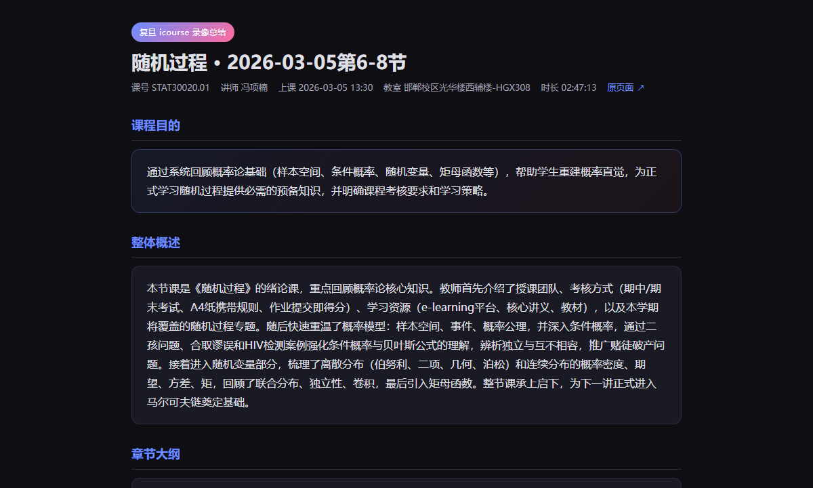
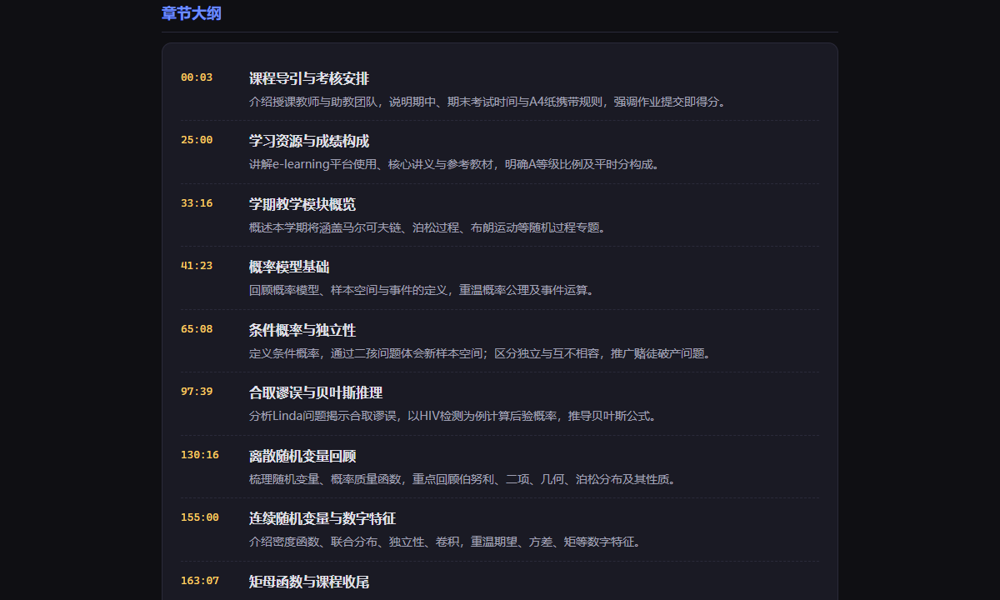

# fudan_pipeline-digest

把复旦 **icourse** 上本来就能看的课堂录像，在本地跑一遍：Whisper 转写 → DeepSeek 总结 → 一份深色 HTML 笔记，复习时浏览器直接打开。

自己用的小工具，跑通过《随机过程》等课，开源出来给同校同学参考。

> 请确保你对录像有合法访问权限，遵守学校平台规定。仓库里只有代码和下面这张截图用的 UI 预览，不含 cookie、API Key 或完整转写文本。

---

## 实际效果（随机过程 · 2026-03-05 第 6–8 节）





<details>
<summary>展开滚动预览（GIF）</summary>


</details>

每节课跑完会在 `output/<课程>/<节次>/summary.html` 生成类似页面，含大纲、概念、自测题和可折叠的全文转录。

---

## 怎么用

```bash
git clone https://github.com/yokipan77-gif/fudan_pipeline-digest.git
cd fudan_pipeline-digest
pip install -r requirements.txt
cp config.example.json config.json   # 填 deepseek_api_key、ffmpeg_path
```

跑之前：连校园 VPN，**关掉 Clash 系统代理**，Chrome 登录 icourse 并开远程调试（9222）。

```bash
python -m src.pipeline "https://icourse.fudan.edu.cn/livingroom?course_id=...&sub_id=..."
```

中途断了可以续跑，例如只重跑总结：

```bash
python -m src.pipeline "..." --skip-cookies --skip-download --skip-transcribe
```

更多命令和排错 → [USAGE.md](./USAGE.md)

---

## 大致流程

1. 从 Chrome（CDP）拿带签名的视频地址和 cookie  
2. 下载 MP4，ffmpeg 抽成 Opus  
3. **faster-whisper** `large-v3`，GPU 批处理  
4. **DeepSeek** 分段 map-reduce 写总结，支持断点  
5. 渲染成上面的 HTML  

设计细节见 [docs/ARCHITECTURE.md](./docs/ARCHITECTURE.md)。分模块自测见 [TEST.md](./TEST.md)。

需要 Python 3.12+、ffmpeg 8+、NVIDIA GPU（推荐）、DeepSeek 或兼容 API。

---

## 许可证

[MIT](./LICENSE)
